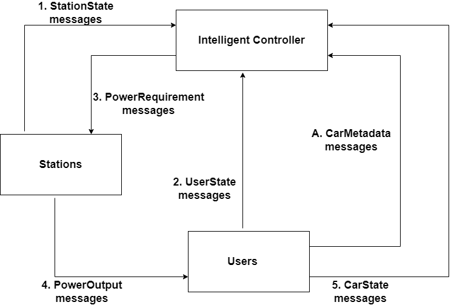
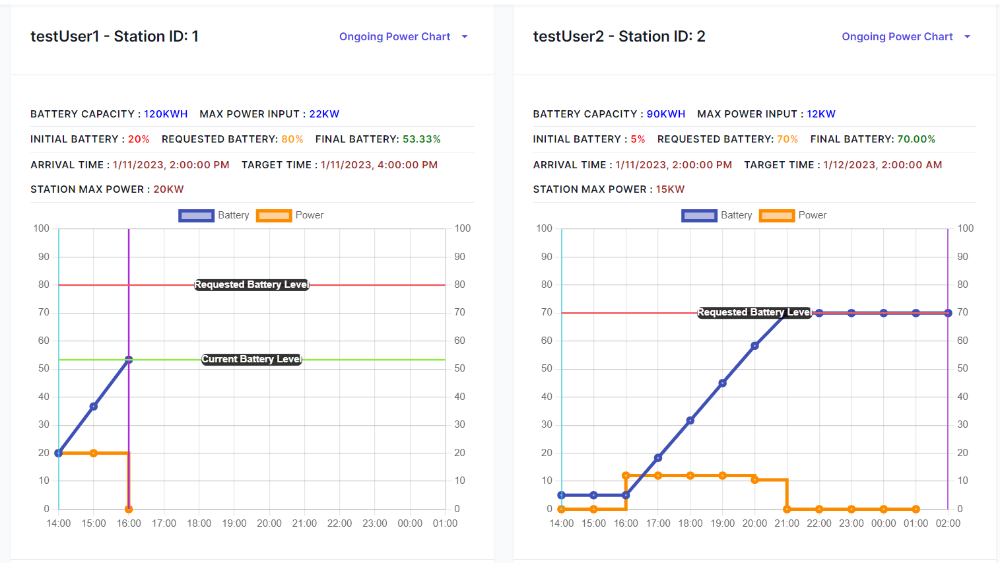
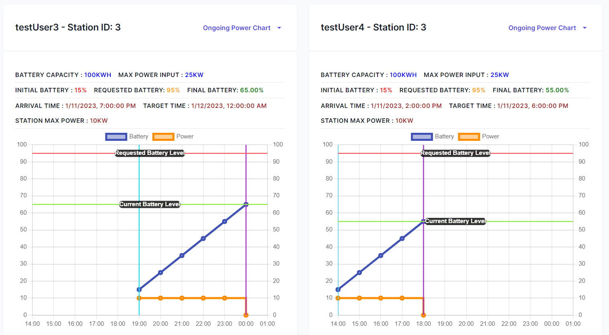

# EV charging demo scenario

## Description

EV charging demo scenario was created as a part of the EVCommunities project.
Contributors of the simulation:

1. Kari Systä, kari.systa@tuni.fi
2. Ville Heikkilä, ville.heikkila@tuni.fi
3. Ali Mehraj, ali.mehraj@tuni.fi
4. Chalith Haputhantrige, chalith.haputhantrige@tuni.fi

Instructions for running the demo scenario: [Running the EV charging demo scenario](energy_run-ev-charging-demo.md)

The scenario describes a complete electric vehicle charging system with 3 main components of [User](energy_user-component.md), [Station](energy_station-component.md), [Intelligent Controller](energy_ic-component.md). There are set number of users and stations at the start of the simulation where the users arrive and leave the stations after charging their electric vehicle. The users send the charging request to the IC and the IC contains the logic and algorithm to determine the power requirements for the stations. The scenario spans over 12 hours with hourly resolution (epochs).

Scenario setup is depicted on image below. For the simplicity of the first version, the spot pricing component is absent in the simulation.

## Scenario details

The scenario has 3 stations, 4 users and 1 intelligent controller.

- The intelligent controller contains the total max power of the charging stations which is 30.0 kW.
- There are four users: user 1, user 2, user 3 and user 4.
- There are 3 stations: station 1, station 2, station 3.

Users and their requirements in the scenario:

- The simulation starts at 2pm.
- User 1 arrives at the start of the simulation to station 1 and requests for a target state of charge of 80% from the initial charge of 20%. The target time for user 1 is 2 hours later at 4pm.
- User 2 arrives at the start of the simulation to station 2 and requests for a state of charge of 70% from the initial charge of 5%. The target time for user 2 is 12 hours later at 2am the next day.
- User 3 arrives to station 3 at 7pm and requests for a state of charge of 95% from the initial charge of 15%. The target time for user 3 is at 5 hours later at midnight.
- User 4 arrives at the start of the simulation to station 3 and requests for a state of charge of 95% from the initial charge of 15%. The target (and leaving) time for user 4 is 6 hours later at 6pm.

Station 1, 2 and 3 have maximum power of 20 kW, 15 kW and 10 kW respectively. The total maximum power output for all stations is 30.0 kW.

The intelligent controller uses a greedy algorithm and prioritizes power output for the stations based on the following aspects:

1. the earliest leaving time of the user
2. the highest total energy requirement by the user
3. the order the users reported in for the current epoch (with the earlier reporter prioritized over later ones)

At the end of the simulation, the collected results are displayed in the graphs below:

## Epochs

| Epoch # | Start time       | End time         |
| ------- | ---------------- | ---------------- |
| 1       | 2023-01-11T14:00 | 2023-01-11T15:00 |
| 2       | 2023-01-11T15:00 | 2023-01-11T16:00 |
| 3       | 2023-01-11T16:00 | 2023-01-11T17:00 |
| 4       | 2023-01-11T17:00 | 2023-01-11T18:00 |
| 5       | 2023-01-11T18:00 | 2023-01-11T19:00 |
| 6       | 2023-01-11T19:00 | 2023-01-11T20:00 |
| 7       | 2023-01-11T20:00 | 2023-01-11T21:00 |
| 8       | 2023-01-11T21:00 | 2023-01-11T22:00 |
| 9       | 2023-01-11T22:00 | 2023-01-11T23:00 |
| 10      | 2023-01-11T23:00 | 2023-01-11T00:00 |
| 11      | 2023-01-12T00:00 | 2023-01-11T01:00 |
| 12      | 2023-01-11T01:00 | 2023-01-12T02:00 |

All times are given in Finnish local time (EEST).

## Power Output from Stations

| Epoch # | Station 1 | Station 2 | Station 3 |
| ------- | ---------------- | ---------------- | ---------------- |
| 1       | 20 | 0 | 10 |
| 2       | 20 | 0 | 10 |
| 3       | 0 | 12 | 10 |
| 4       | 0 | 12 | 10 |
| 5       | 0 | 12 | 0 |
| 6       | 0 | 12 | 10 |
| 7       | 0 | 10.49 | 10 |
| 8       | 0 | 0 | 10 |
| 9       | 0 | 0 | 10 |
| 10       | 0 | 0 | 10 |
| 11       | 0 | 0 | 0 |
| 12       | 0 | 0 | 0 |
